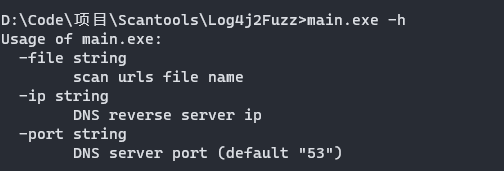
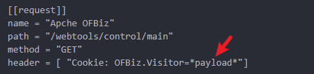
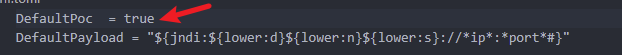
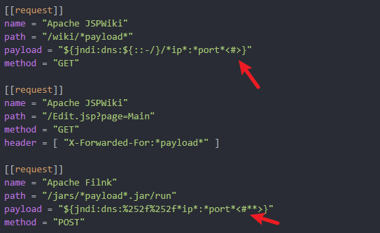
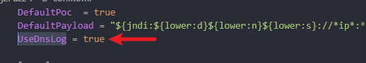

## Log4j2 RCE 扫描工具

## 编译

```go
go build main.go
```

## 使用方法



工具内置了dns协议，如果目标存在漏洞，将会收到回显。

payload格式为：

```shell
${jndi:dns://x.x.x.x:53/xx}
```

支持自定义扫描的url path，header，body 和 payload。 只需将配置项加入到conf.toml文件中即可。

例如：



paylod部分需要使用`*payload*`进行标识



如果自定义payload的`/`分隔符需要进行特殊处理，例如进行url编码或者url二次编码，请将对应位置标记为`<#*>`或者`<#**>`

> `<#>`表示不编码，即正常的`/`
>
> `<#*>`表示一次url编码，即`%2F`
>
> `<#**>`表示二次url编码，即`%252F`



工具内置了常见了header部分和body部分进行fuzz，如果你不想使用工具自带的fuzz,请将上述的DefaultPoc置为`false`

## 版本更新

新版本中支持了dnslog平台的使用，目前仅支持`ceye.io`
请在`conf.toml`配置文件中配置对应的`domain`和`token`使用，并将UseDnsLog置为`true`。


